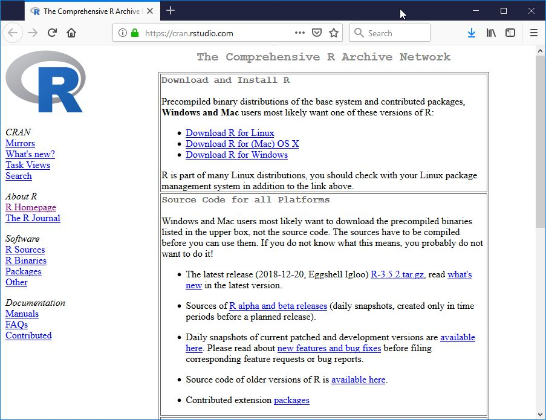
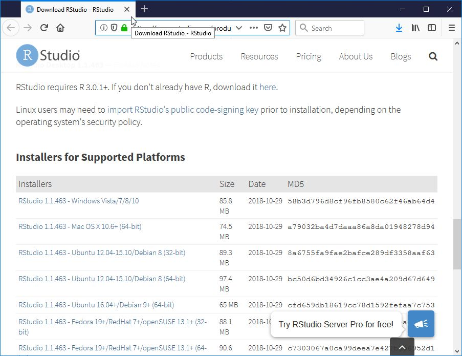
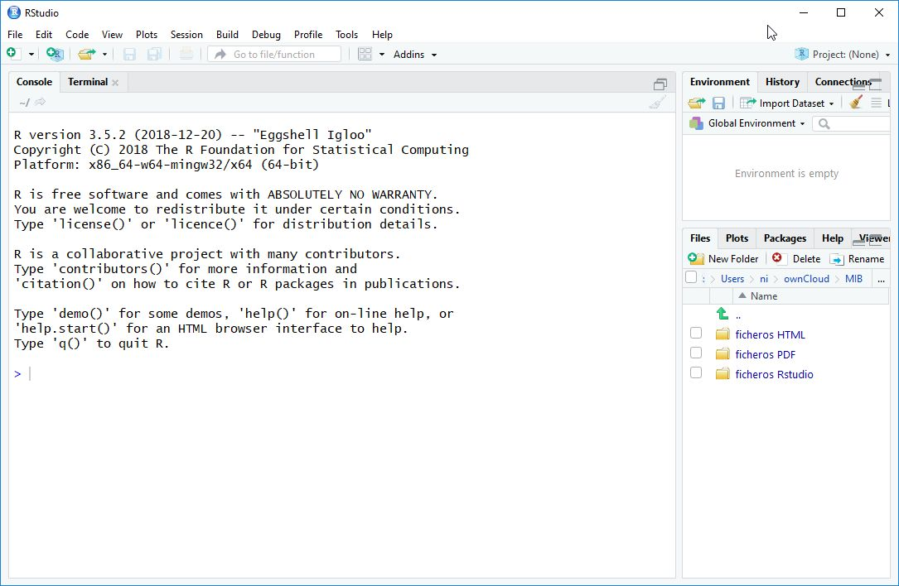
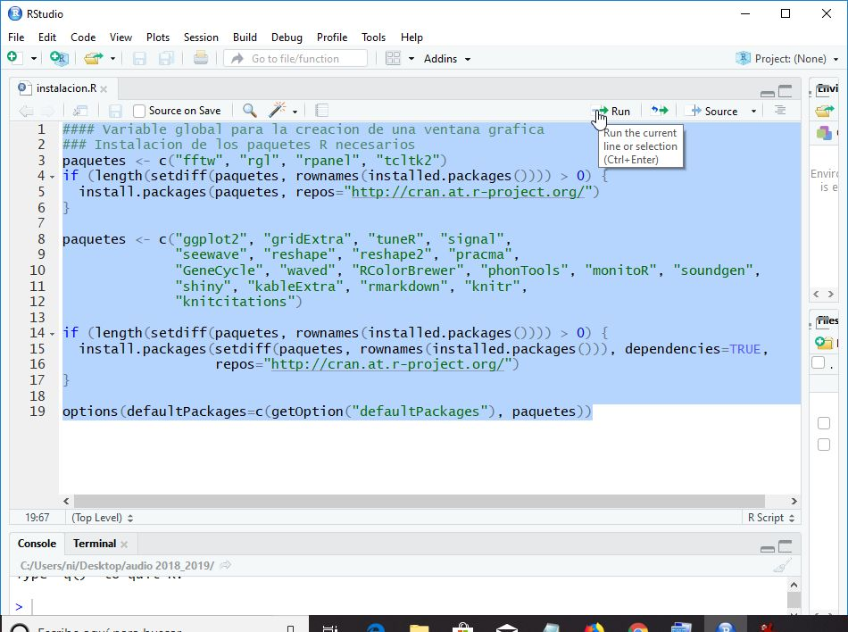
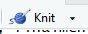
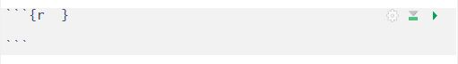

```{r setup0, echo=FALSE, include=FALSE, warning=FALSE}
### Instalacion de los paquetes R necesarios
knitr::opts_chunk$set(echo = TRUE, fig.align='center', out.width = '80%')
library("knitr")
```

---------------------------------------

# Instalación de R y Rstudio

`R` es un entorno y lenguaje de programación con un enfoque al análisis estadístico. `R` es parte del sistema GNU y se distribuye bajo la licencia GNU GPL. Está disponible para los sistemas operativos Windows, Macintosh, Unix y GNU/Linux.

`RStudio` es un entorno de desarrollo integrado para el lenguaje de programación `R`, dedicado a la computación estadística y gráficos. 

Incluye una consola, editor de sintaxis que apoya la ejecución de código, así como herramientas para el trazado, la depuración y la gestión del espacio de trabajo. 

Antes de instalar `Rstudio` debemos instalar `R`: [**link**](https://cran.rstudio.com/)

```{r, echo=FALSE, out.width='40%'}

```

Una vez instalado `R`, realizamos la instalación de `Rstudio`: [**link**](https://www.rstudio.com/products/rstudio/download/#download)

```{r, echo=FALSE, out.width='40%'}

```

Finalmente, ejecutamos `Rstudio`:

```{r, echo=FALSE, out.width='40%'}

```

Como podemos ver, la pantalla se divide en tres secciones:

1. A la izquierda, la consola donde se ejecutan los comandos de `R`.

2. A la derecha, en la parte superior, tenemos una ventana que muestra nuestro entorno (*environment*) de trabajo, en el que iremos viendo las variables y funciones que vayamos cargando, creando, etc. Esta ventana tiene algunos iconos que permiten guardar el contenido de la memoria, cargar el contenido de la memoria de una sesión de trabajo anterior, importar archivos de datos que se hayan guardado como texto, y limpiar el contenido de la memoria.

3. A la derecha, en la parte inferior, se muestra el contenido de nuestro directorio *home* donde `R` arranca por defecto. Esta ventana tiene varias pestañas:
    - *Files*: Archivos en el directorio actual.
    - *Plots*: En esta ventana se muestran los gráficos generados con el programa.
    - *Packages*: Permite ver las librerías instaladas.
    - *Help*: Ayuda sobre `R`.
    - *Viewer*: Acceso a contenido web local.

---------------------------------------

# Instalación de los paquetes necesarios para el desarrollo del módulo

La instalación de los paquetes necesarios para la ejecución de los ficheros `Rmd` solamente se realiza una vez. Para ello, ejecutaremos el siguiente comando:

```{r setup, echo=TRUE}
#### Variable global para la creacion de una ventana grafica
### Instalacion de los paquetes R necesarios
paquetes <- c("fftw", "rgl", "rpanel", "tcltk2")
if (length(setdiff(paquetes, rownames(installed.packages()))) > 0) {
      install.packages(paquetes, repos="http://cran.at.r-project.org/")
}

paquetes <- c("ggplot2", "gridExtra", "tuneR", "signal", 
		"seewave", "reshape", "reshape2", "pracma", 
		"GeneCycle", "waved", "RColorBrewer", "phonTools", "monitoR", "soundgen", 
		"shiny", "kableExtra", "rmarkdown", "knitr", 
		"knitcitations")

if (length(setdiff(paquetes, rownames(installed.packages()))) > 0) {
  		install.packages(setdiff(paquetes, rownames(installed.packages())), dependencies=TRUE, 			
  		                 repos="http://cran.at.r-project.org/")  
}

options(defaultPackages=c(getOption("defaultPackages"), paquetes))

```

Si tenéis problemas con la instalación del paquete `seewave`, por favor, seguid las indicaciones que se muestran 
en esta [página](http://rug.mnhn.fr/seewave/inst.html) ya que, en algunos casos, hay problemas de instalación de este paquete en linux y Mac OS.


Podéis encontrar este código en el fichero `instalacion.R`. Seleccionad todos los comandos y pulsar el icono **`Run`** como podéis ver en la figura:

```{r, echo=FALSE, out.width='40%'}

```

---------------------------------------

## Errores durante la instalación

Por favor, revisad que no haya ningún error al terminar la instalación.

Si lo hay, intentad reinstalar ese paquete solamente. Si no funciona, enviadme un mensaje en el foro o a mi dirección de email.

---------------------------------------

# Ficheros de tipo RMarkdown (Rmd)

El paquete `Rmarkdown` permite la creación de informes estáticos que combinan texto con código y resultados, gráficos incluídos, generados con `R`. Aprender Rmarkdown implica aprender dos cosas distintas:

  1. [**Markdown**](https://es.wikipedia.org/wiki/Markdown)  un formato para escribir documentos simples en modo texto. Tiene la ventaja de ser fácilmente legible por humanos pero, a la vez, procesable programáticamente para volcarlos en otros formatos: pdf, html, etc.
  
  2. La integración entre `R` y `Markdown`.


Los archivos para producir documentos `R Markdown` tienen extensión `.Rmd` y se abren con `Rstudio` y se ejecutan mediante el botón **`Knit`**. El resultado es un documento en formato .pdf, .html, o .doc.

```{r, echo=FALSE, out.width='10%'}

```

---------------------------------------

Este es un documento generado mediante el lenguaje de marcado `R Mardkown`.

En `R Markdown` podemos mezclar texto y código de `R`. Por ejemplo, si queremos ver el sumario del conjunto de datos `cars`, insertaremos en el fichero un trozo de código (*chunks*) en `R`. Para ello, seleccionamos **`Code`** -> **`Insert Chunk`**. Esto produce:

```{r, echo=FALSE, out.width='50%'}

```

Existen múltiples opciones para modificar el comportamiento de un *chunk*. Podemos pulsar
la tecla `Tab` dentro de las llaves (a continuación de `r`) para que aparezca un listado
de todas las opciones. 

Algunas de las más relevantes son:

* Nombrar un *chunk* (para hacer referencia en el documento y también para organizar
mejor nuestro contenido):  
`{r nombre_chunk}`
* No mostrar la el código R de entrada en el documento:  
`{r echo=FALSE}`
* Mostrar el contenido del chunk directamente como código:  
`{r echo=FALSE results='asis'}`
* No ejecutar el código de R suministrado:  
`{r eval=FALSE}`

Cuando utilicéis los ficheros que incluimos en este curso, podrás ver muchos de estos parámetros en los **chunks** que hemos incluido.

No obstante, incluimos algunos enlaces donde podéis conocer más sobre los ficheros Rmarkdown: [**link 1**](https://www.rstudio.com/wp-content/uploads/2015/03/rmarkdown-spanish.pdf), [**link 2**](https://rmarkdown.rstudio.com/authoring_quick_tour.html), [**link 3**](https://rmarkdown.rstudio.com/lesson-1.html) y [**link 4**](https://bookdown.org/yihui/rmarkdown/).

Y algún enlace más de introducción a R: [**link 4**](https://cran.r-project.org/doc/contrib/rdebuts_es.pdf) y [**link 5**](https://cran.r-project.org/doc/contrib/R-intro-1.1.0-espanol.1.pdf).

---------------------------------------

En nuestro caso, finalmente incluimos el código que deseemos. Nótese que en este caso hemos elegido algunos parámetros como `echo=TRUE` (para que se muestre el código en la página HTML que vamos a generar) y `warning=FALSE` (para que no muestre mensajes de aviso).

```{r resumen, echo=TRUE, warning=FALSE}
summary(cars)
```

Y visualizamos los datos:

```{r plot, echo=TRUE}
plot(cars)
```

---------------------------------------
