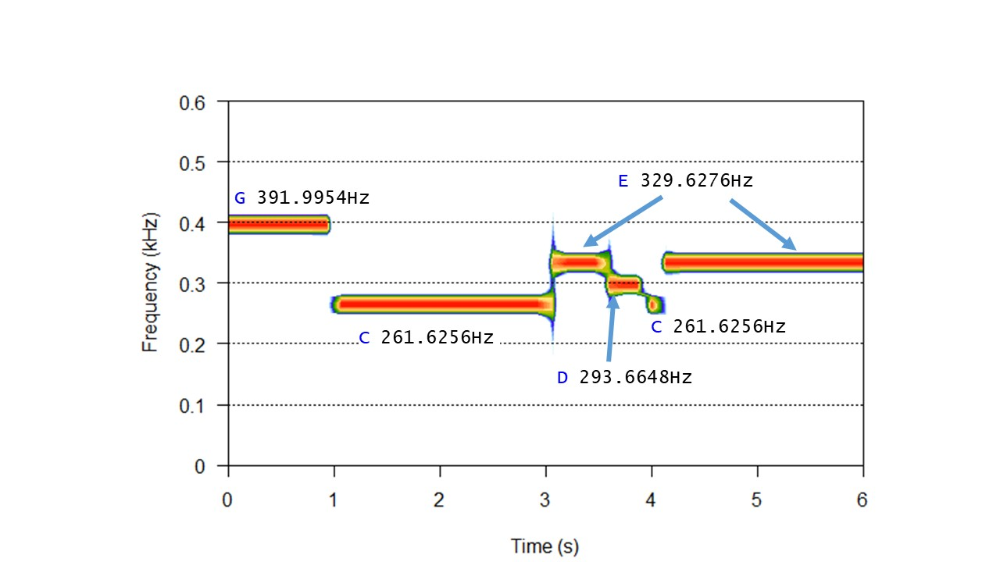

```{r setup, include=FALSE}
knitr::opts_chunk$set(echo = TRUE, fig.align='center', out.width = '80%')
library("shiny")
library("tuneR")
library("seewave")
library("kableExtra")
library("dplyr")
```

---------------------------------------

# Indicaciones previas

* Para oir una señal de audio, guardaremos la variable que contiene el audio en formato "Wave" en un fichero de tipo ".wav" en la carpeta temporal denominada "www". Una vez realizado este paso, podemos escuchar este fichero mediante el objeto [**`tags$audio`**](https://shiny.rstudio.com/articles/tag-glossary.html) del paquete `shiny` como se muestra a continuación:

```{r, eval=FALSE}
# El audio almacenado en la variable (en formato Wave) lo guardamos en la carpeta 
# temporal llamada "www" en un fichero de tipo ".wav"
savewav(variable, filename="www/<nombre Audio>.wav")

# Oimos el audio mediante el objeto del paquete "shiny"
tags$audio(src = "www/<nombre Audio>.wav", type = "audio/wav", autostart="false", controls = NA)
```

* Si el fichero de audio se encuentra en un cierto directorio, como por ejemplo el directorio "audio", podemos escuchar este fichero mediante el siguiente comando:
```{r, eval=FALSE}
# Oimos el audio mediante el objeto del paquete "shiny"
tags$audio(src = "audio/harmonics_1_to_10.mp3", type = "audio/mp3", autostart="false", controls = NA)

```

* No obstante, debemos hacer notar que si Rstudio no ejecuta el fichero ".Rmd" en su "Viewer" interno sino en una ventana externa, es posible que no pueda oirse la señal. En ese caso, utilizar el botón "Open in Browser" que podéis encontrar en la cabecera de la página. Una vez que se abra el fichero ".html" correspondiente, podréis oir la señal de audio sin problemas.

* Si se utiliza la función `writeWave()` en vez de la función `savewav()`, es posible que haya que normalizar la señal previamente mediante el comando [**`normalize()`**](https://www.rdocumentation.org/packages/tuneR/versions/1.3.3/topics/normalize-methods) del paquete `tuneR`.

------------------------------------------

# Ejercicio 1

* Generar una onda coseno donde el intervalo de tiempo ($t$) va de 0s a 1s con incremento de 0.01s.

```{r}
# Intervalo de tiempo de 0s a 1s con un incremento de 0.01s
t <- seq(0, 1, 0.01)

# Figura de la onda coseno
plot(t, cos(2*pi*t), type = 'l', xlab= "Tiempo(s)", ylab = "Amplitud")
```

------------------------------------------

# Ejercicio 2

* Sumar una onda coseno y una onda seno de frecuencia 1Hz y 2Hz, amplitud 1 y 2 respectivamente, fase de 0 radianes y $\pi$ radianes, intervalo de tiempo ($t$) que va de 0 a 3 segundos y tiene una longitud total de 3000 muestras. ¿ Cuál es la frecuencia de muestreo ? Visualizar las tres ondas en una única gráfica para el intervalo de tiempo de 0 a 3 segundos.

  La frecuencia de muestreo es el número de veces por segundo que cambia una señal digital. Por ejemplo, si la frecuencia de muestreo es de 44100Hz, significa que tomamos 44100 muestras por segundo. En nuestro caso, 

  $$fs = \frac{3000\: muestras}{3s} = 1000 Hz$$

```{r, echo=TRUE, warning=FALSE, fig.show='hold', fig.height = 6, results='asis'}
# Intervalo de tiempo de 0s a 3s con un incremento de 1/fs
t <- seq(0, 3, by = 1/1000)

# Primera onda coseno de frecuencia 1Hz, amplitud = 1, fase = 0 radianes
a1 <- 1
f1 <- 1
fase1 <- 0
o1 <- a1 * cos(2*pi*f1*t+fase1)

# Segunda onda coseno de frecuencia 2Hz, amplitud = 2, fase = pi radianes
a2 <- 2
f2 <- 2
fase2 <- pi
o2 <- a2 * sin(2*pi*f2*t+fase2)

# Suma de las dos ondas coseno
o12 <- o1 + o2

# Figura de las ondas
op<-par(mfrow=c(3,1))
	plot(t, o1,  type = 'l', main = "onda coseno", xlab= "Tiempo(s)", ylab = "Amplitud")
	plot(t, o2,  type = 'l', main = "onda seno", xlab= "Tiempo(s)", ylab = "Amplitud")
	plot(t, o12, type = 'l', main = "onda coseno+seno", xlab= "Tiempo(s)", ylab = "Amplitud")
par(op)
```

------------------------------------------

# Ejercicio 3

* Generar la nota *middle C* (262Hz) con frecuencia de muestreo 16000Hz y 2.5s de duración. Para obtener la onda en formato *Wave*, ver documentación de función [**`synth()`**](https://www.rdocumentation.org/packages/seewave/versions/2.1.0/topics/synth) del paquete `seewave`.

```{r}
# Frecuencia de muestreo
fs <- 16000
# Duracion de la nota
duracion <- 2.5
# Frecuencia fundamental de la nota middle C
frecuencia = 262

# La nota middleC: Salida en formato "Wave"
middleC <- synth(f=fs, d=duracion, cf=frecuencia, output="Wave")

# formato Wave (informacion)
print(middleC)

# Para acceder a alguna propiedad de la senal de audio, podemos consultar:
str(middleC)

# Por ejemplo, frecuencia de muestreo
middleC@samp.rate
```

Para oir la nota *middle C* (262Hz), escribimos la señal de audio en el directorio "www" y oimos el fichero generado almacenado en dicho directorio: `www/middleC.wav`.

```{r, echo=TRUE}
# Oimos la nota
savewav(middleC, filename="www/middleC.wav")
tags$audio(src = "www/middleC.wav", type = "audio/wav", autostart="false", controls = NA)
```

------------------------------------------

# Ejercicio 4

* Generar un *chirp* de dos segundos y frecuencia de muestreo de 8000Hz que vaya de la nota *middleC* a la frecuencia más alta reproducible de esta señal. ¿ Cómo se denomina esta frecuencia más alta reproducible ?

* **Nota**: Un [*chirp*](https://en.wikipedia.org/wiki/Chirp) o una frecuencia modulada pulsada es una señal en la cual la frecuencia crece (*up-chirp*) o decrece (*down-chirp*) en el tiempo. 

* En nuestro caso, vamos a hacer que el *chirp* crezca desde 0 hasta la **frecuencia-Nyquist** Hz (ascendente). La frecuencia más alta reproducible es la mitad de la frecuencia de muestreo empleada, lo que se conoce como la **frecuencia Nyquist**:

$$fs = 8000 \rightarrow \mbox{frecuencia Nyquist} = fs/2 = 4000$$

```{r}
# Frecuencia de muestreo = 8000 Hz
fs <- 8000
# Duracion de la senal = 2 segundos
duracion <- 2
# Frecuencia Nyquist
fn <- fs/2
# Frecuencia fundamental de la nota middle C
frecuencia = 262
# Chirp
c <- synth(f=fs, cf=frecuencia, d=duracion, fm=c(0,0,fn,0,0), out="Wave")

# Espectro de la senal chirp
spectro(c, tlab="Tiempo(s)", flab="Frecuencia(kHz)",
	     alab = "Amplitud", scalelab = "Amplitud\n(dB)")
```

```{r, echo=FALSE}
# Oimos el chirp
savewav(c, filename="www/chirp.wav")
tags$audio(src = "www/chirp.wav", type = "audio/wav", autostart="false", controls = NA)
```

------------------------------------------

# Ejercicio 5

* Generar la nota *middleC* (262Hz) y los 4 primeros armónicos con una frecuencia de muestreo de 44100Hz y 2 segundos de duración.

* **Nota**: Una forma de obtener la frecuencia de una nota es mediante la función [**`notefreq()`**](http://www.rdocumentation.org/packages/seewave/versions/2.1.0/topics/notefreq). Para incluir los armónicos de una nota podemos utilizar el parámetro `harmonics` de la función [**`synth()`**](https://www.rdocumentation.org/packages/seewave/versions/2.1.0/topics/synth).

```{r}
# Frecuencia de muestreo
fs <- 44100
# Duracion de la nota
duracion <- 2

# Nota middleC y sus tres primeros armonicos (frecuencia fundamental(F0) + 3 multiplos de F0)
c <- synth(f=fs, d=duracion, cf=notefreq("C", octave=3), harmonics=rep(1, 4), out="Wave")

# Espectro de la senal 
spectro(c, flim=c(0, 1.5), 
        tlab="Tiempo(s)", flab="Frecuencia(kHz)",
	      alab = "Amplitud", scalelab = "Amplitud\n(dB)")
```

```{r, echo=FALSE}
# Oimos la nota middleC y sus armonicos
savewav(c, filename="www/middleC_armonicos.wav")
tags$audio(src = "www/middleC_armonicos.wav", type = "audio/wav", autostart="false", controls = NA)
```

------------------------------------------

# Ejercicio 6

* Leer la señal "mdwh0_sx305.wav" mediante la función [**`readWave()`**](http://www.rdocumentation.org/packages/tuneR/versions/1.3.2/topics/readWave) y oirla.

```{r}
# Cargamos el audio (se puede elegir otro audio)
y <- readWave("audio/mdwh0_sx305.wav")

# La frecuencia de muestreo
(fs <- y@samp.rate)
```

```{r, echo=TRUE}
# Oimos el audio
tags$audio(src = "audio/mdwh0_sx305.wav", type = "audio/wav", autostart="false", controls = NA)
```

------------------------------------------

* Obtener el espectro de la señal con un tamaño de ventana de 5ms. Obtener el espectro de la señal con un tamaño de ventana de 30ms. ¿ Cuál de estos espectrogramas es un espectrograma *wideband* y cuál es un espectrograma *narrowband* ?

  Si queremos obtener el espectro de la señal (banda ancha, *wideband*) con un tamaño de ventana de $5ms = 5/1000 \:s$, el número de muestras de la ventana es: 

$$wl = (5/1000)*fs = (5/1000)*16000 = 80 \: muestras$$

  Si queremos obtener el espectro de la señal (banda estrecha, *narrowband*) con un tamaño de ventana de $30ms = 30/1000 \:s$, el número de muestras de la ventana es: 

$$wl = (30/1000)*fs = (30/1000)*16000 = 480 \: muestras$$

```{r, fig.show='hold', results='asis', out.width = '100%'}
op<-par(mfrow=c(1,2))
	spectro(y, wl=80, scale=F, flim=c(0, 6), main = "wl=80", 
	        tlab="Tiempo(s)", flab="Frecuencia(kHz)",
	        alab = "Amplitud", scalelab = "Amplitud\n(dB)")
	spectro(y, wl=480, scale=F, flim=c(0, 6), main = "wl=480",
	        tlab="Tiempo(s)", flab="Frecuencia(kHz)",
	        alab = "Amplitud", scalelab = "Amplitud\n(dB)")
par(op)
```

------------------------------------------

* Para cada uno de los tamaños de ventana, segmentar la señal. Ver parámetro `msmooth` de la función [**`timer()`**](http://www.rdocumentation.org/packages/seewave/versions/2.1.0/topics/timer) del paquete `seewave`.

```{r, fig.show='hold', results='asis', fig.height=6, out.width = '100%'}
op<-par(mfrow=c(2,1))
	timer(y, threshold=5, msmooth=c(80,0), bty="l", colval="blue", 
	      main='wideband', xlab = "Tiempo(s)", ylab = "Amplitud")
	timer(y, threshold=5, msmooth=c(480,0), bty="l",colval="blue",
	      main='narrowband', xlab = "Tiempo(s)", ylab = "Amplitud")
par(op)
```

------------------------------------------

  * **Nota**: El audio se ha obtenido de la página: [**Link pagina**](http://www.ee.columbia.edu/~dpwe/e6820/matlab/). 
  
  * El número de muestras de la ventana viene dado por:

$$wl = \mbox{número de segundos} * \mbox{frecuencia de muestreo}$$

  * Veáse también [**Características del Espectrograma**](http://es.wikipedia.org/wiki/Espectrograma#Caracter%C3%ADsticas).

------------------------------------------

# Ejercicio 7

* Crear las primeras 10 notas de la canción "Amazing Grace". Crear el ritmo correcto de la mejor forma posible. Las notas de la melodía son (una de la muchas versiones): G, C, E, D, C, E, D, C, A, G y las longitudes de las notas son: 1, 2, 1/2, 1/3, 1/6, 2, 1, 2, 1, 2.

  Podemos utilizar las funciones [**`synth()`**](https://www.rdocumentation.org/packages/seewave/versions/1.4.5/topics/synth) y [**`pastew()`**](https://www.rdocumentation.org/packages/seewave/versions/2.1.0/topics/pastew) del paquete `seewave`:

```{r}
# Frecuencia de muestreo (puede cambiarse)
fs <- 16000

# Notas que forman parte de la cancion
fC <- notefreq("C")
fG <- notefreq("G")
fE <- notefreq("E")
fD <- notefreq("D")
fA <- notefreq("A")

# La lista de notas
listaNota <- c(fG, fC, fE, fD, fC, fE, fD, fC, fA, fG)
# La longitud de cada nota
listaLong <- c(1, 2, 1/2, 1/3, 1/6, 2, 1, 2, 1, 2)

# Generamos las 10 primeras notas de la cancion mediante un bucle (for)
cancion <- synth(f=fs, d=listaLong[1], cf=listaNota[1], plot=FALSE, output="Wave")
for (i in 2:10) {
	  # Generacion de la nota i-esima
  	nota    <- synth(f=fs, d=listaLong[i], cf=listaNota[i], plot=FALSE, output="Wave")
  	# Concatenamos la nota a la cancion
  	cancion <- pastew(nota, cancion, at="end", plot=FALSE, output="Wave")
}

```

```{r, echo=FALSE}
# Oimos la cancion
savewav(cancion, filename="www/amazing_grace.wav")
tags$audio(src = "www/amazing_grace.wav", type = "audio/wav", autostart="false", controls = NA)
```

------------------------------------------

* Seleccionar dos valores de la longitud de la ventana y calcular el tamaño de la ventana en ms para cada caso.

  Si la frecuencia de muestreo ($fs$) es de 16000Hz y el tamaño de la ventana es de 1024 muestras ($wl=1024$), la duración de la ventana en ms es:

$$(1/fs) * wl = 0.064s = 64ms$$

  Si la frecuencia de muestreo ($fs$) es de 16000Hz y el tamaño de la ventana es de 512 muestras ($wl=512$), la duración de la ventana en ms es:

$$(1/fs) * wl = 0.032s = 32ms$$

------------------------------------------

* Calcular el espectro de la señal para las longitudes de la ventana seleccionadas. Ver qué efectos se producen. Podemos utilizar la función [**`spectro()`**](https://www.rdocumentation.org/packages/seewave/versions/2.1.0/topics/spectro).

  * **Nota**: El tipo de ventana seleccionada es la ventana por defecto (ventana de *Hanning*)

```{r, fig.show='hold', results='asis', out.width = '100%', fig.height=4}
### Efecto del tamano de ventana
op<-par(mfrow=c(1,2))
	spectro(cancion, wl=512, scale=F, flim=c(0, 0.6), main = "Espectrograma, wl=512", 
	        tlab="Tiempo(s)", flab="Frecuencia(kHz)",
	        alab = "Amplitud", scalelab = "Amplitud\n(dB)")
	spectro(cancion, wl=1024, scale=F, flim=c(0, 0.6), main = "Espectrograma, wl=1024", 
	        tlab= "Tiempo(s)", flab= "Frecuencia(kHz)", 
	        alab = "Amplitud", scalelab = "Amplitud\n(dB)")
par(op)
```

------------------------------------------

* Seleccionar una longitud de ventana y calcular el espectro utilizando un tipo de ventana distinto al utilizado en el apartado anterior de este ejercicio. Ver qué efectos se producen.

  Para ver el efecto del tipo de ventana, elegimos la longitud de ventana de 1024 muestras y seleccionamos cuatro tipos de ventanas: `barlett`, `blackman`, `hamming` y `rectangle`.

```{r, fig.show='hold', results='asis', out.width = '100%', fig.height=6}
### Efecto del tipo de ventana
op<-par(mfrow=c(2, 2))
	spectro(cancion, wn="bartlett", wl=1024, scale=F, flim=c(0, 0.6), 
	        main = "Espectrograma Barlett, wl=1024", 
	        tlab= "Tiempo(s)", flab= "Frecuencia(kHz)", 
	        alab = "Amplitud", scalelab = "Amplitud\n(dB)")
	spectro(cancion, wn="blackman", wl=1024, scale=F, flim=c(0, 0.6), 
	        main = "Espectrograma Blackman, wl=1024", 
	        tlab= "Tiempo(s)", flab= "Frecuencia(kHz)", 
	        alab = "Amplitud", scalelab = "Amplitud\n(dB)")
	spectro(cancion, wn="hamming", wl=1024, scale=F, flim=c(0, 0.6), 
	        main = "Espectrograma Hamming, wl=1024", 
	        tlab= "Tiempo(s)", flab= "Frecuencia(kHz)", 
	        alab = "Amplitud", scalelab = "Amplitud\n(dB)")
	spectro(cancion, wn="rectangle", wl=1024, scale=F, flim=c(0, 0.6), 
	        main = "Espectrograma Rectangle, wl=1024", 
	        tlab= "Tiempo(s)", flab= "Frecuencia(kHz)", 
	        alab = "Amplitud", scalelab = "Amplitud\n(dB)")
par(op)
```

------------------------------------------

* Visualizar algunas partes del espectro (por ejemplo, de 0s a 6s) e identificar visualmente algunas de las primeras notas.

  Para la identificación de las notas, la siguiente figura nos resultará de mucha utilidad:

```{r, echo=FALSE, out.width='60%'}

```

  El espectro de los primeros 6 segundos de la canción utilizando una ventana de Blackman de 1024 muestras es:
```{r}
### Espectro de la cancion "Amazing Grace"
spectro(cancion, wn="blackman", wl=1024, scale=F, flim=c(0, 0.6), tlim=c(0, 6), 
        main = "Espectrograma Blackman, wl=1024", 
        tlab= "Tiempo(s)", flab= "Frecuencia(kHz)", 
	      alab = "Amplitud", scalelab = "Amplitud\n(dB)")
```

------------------------------------------

* Realizar el seguimiento del *pitch* mediante:
    + autocorrelación a partir de la función [**`autoc()`**](http://www.rdocumentation.org/packages/seewave/versions/2.1.0/topics/autoc)
    + espectro medio y la función [**`fpeaks()`**](https://www.rdocumentation.org/packages/seewave/versions/2.1.0/topics/fpeaks)
    + funciones del paquete `tuneR` tales como [**`periodogram()`**](https://www.rdocumentation.org/packages/tuneR/versions/1.3.3/topics/periodogram-methods), [**`FF()`**](https://www.rdocumentation.org/packages/tuneR/versions/1.3.3/topics/FF), [**`noteFromFF()`**](https://www.rdocumentation.org/packages/tuneR/versions/1.3.3/topics/noteFromFF) y [**`melodyplot()`**](https://www.rdocumentation.org/packages/tuneR/versions/1.3.3/topics/melodyplot)
    
------------------------------------------

* Seguimiento del *pitch* a partir de la función de autocorrelación:

```{r}
### Pitch tracking a partir de la autocorrelacion
res <- autoc(cancion, f=fs, wl=2048, plot=F)

# Tracking del pitch (grafica)
plot(res[,1], res[,2], type="l", main = "Pitch Tracking", xlab="Tiempo(s)", ylab="Frequencia")

# Obtenemos las notas que forman esta cancion
notas  <- unique(res[,2])
notas
```

------------------------------------------

* Seguimiento del *pitch* a partir del cálculo del [**espectro medio**](http://www.rdocumentation.org/packages/seewave/versions/2.1.0/topics/meanspec) y de la función [**`fpeaks()`**](http://www.rdocumentation.org/packages/seewave/versions/2.1.0/topics/fpeaks):

```{r}
### Pitch tracking a partir de la funcion fpeaks()
s     <- meanspec(cancion@left, fs, wl=1024, wn="blackman", plot=F)
picos <- fpeaks(s, plot=F)
```

```{r, echo=FALSE, results='asis'}
# Tracking del pitch (frecuencias encontradas) en una tabla
kable(picos, col.names=c("Frecuencia", "Amplitud"), row.names=FALSE) %>%
  kable_styling(full_width = F)
```

```{r}
# Tracking del pitch (grafica)
fpeaks(s, plot=T, xlim=c(0,1.2), xlab = "Frecuencia(kHz)", ylab = "Amplitud")
```

------------------------------------------

  Con respecto a la función `fpeaks` y a las notas musicales, tenemos que observar que cuando se analizan sonidos musicales, las frecuencias más altas que nos encontraremos andarán alrededor de 12-20kHz dependiendo de los instrumentos musicales. 

  No obstante, esa frecuencia más alta no nos proporciona una estimación de la nota que se está 
reproduciendo, ya que una nota musical, cuando se genera a partir de un instrumento viene dada 
por una mezcla de múltiples frecuencias (timbre de un instrumento).

  Por ejemplo, la nota A4 (440Hz) tocada por una flauta incluye componentes de frecuencia diferentes a los de una A4 interpretada por una guitarra eléctrica. Por ello, es mejor analizar la frecuencia dominante mirando los picos de frecuencia en el ventaneado de la señal y comprobar dónde se encuentra el pico más alto.

  Sin embargo, no existe la "frecuencia en el tiempo" y sólo puedes trazar la frecuencia promedia (o dominante) sobre ciertas ventanas de tiempo. Una forma de resolver el problema es con el cálculo de las propiedades del espectro, función [**`specprop()`**](http://www.rdocumentation.org/packages/seewave/versions/2.1.0/topics/specprop) del espectro medio dado por la función [**`meanspec()`**](http://www.rdocumentation.org/packages/seewave/versions/2.1.0/topics/meanspec): ver parámetros `centroid` y `mean`.

```{r}
### Propiedades del espectro medio
s     <- meanspec(cancion@left, fs, wl=1024, wn="blackman", plot=F)
# Visualizacion de las propiedades del espectro
specprop(s, plot=TRUE, xlab = "Frecuencia(kHz)", ylab="Probabilidad")

# Por ejemplo, la media del espectro medio
props <- specprop(s)
props$mean
```

  En la siguiente tabla, vemos las 14 propiedades del espectro:

```{r, echo=FALSE, results='asis'}
dprops <- data.frame(props)
# Propiedades en una tabla
kable(dprops[,1:7], digits=2, row.names=FALSE) %>%
  kable_styling(full_width = F)
kable(dprops[,8:14], digits=2, row.names=FALSE) %>%
  kable_styling(full_width = F)
```

------------------------------------------

* Seguimiento del *pitch* a partir de las funciones del paquete `tuneR`  [**`periodogram()`**](https://www.rdocumentation.org/packages/tuneR/versions/1.3.3/topics/periodogram-methods), [**`FF()`**](https://www.rdocumentation.org/packages/tuneR/versions/1.3.3/topics/FF), [**`noteFromFF()`**](https://www.rdocumentation.org/packages/tuneR/versions/1.3.3/topics/noteFromFF), [**`melodyplot()`**](https://www.rdocumentation.org/packages/tuneR/versions/1.3.3/topics/melodyplot) y la función que nos proporciona el nombre de las notas [**`notenames()`**](http://www.rdocumentation.org/packages/tuneR/versions/1.3.2/topics/notenames)
    
  Mediante las funciones del paquete `tuneR` podemos ver las notas de la canción. Para ello, primero calculamos el periodograma de la señal y realizamos un seguimiento de la frecuencia fundamental. Una vez calculadas las frecuencias fundamental, obtenemos la frecuencia y los nombres de las notas. Finalmente, visualizamos la melodía.

```{r, warning=FALSE, out.width = '100%'}
### Pitch tracking a pariir del periodograma
perioWav <- periodogram(cancion, width = 1024)
freqWav <- FF(perioWav)
noteWav <- noteFromFF(freqWav)

### Sin suavizado
melodyplot(perioWav, observed = noteWav, plotenergy = F, xlab = "Tiempo", ylab="Nota")
# Nombre de las notas
noteWavNames <- noteWav[!is.na(noteWav)]
notenames(noteWavNames)
```

  Y mediante la función de suavizado [**`smoother()`**](https://www.rdocumentation.org/packages/tuneR/versions/1.3.3/topics/smoother), vemos la melodía suavizada en la siguiente figura:

```{r, message=FALSE, warning=FALSE, out.width = '100%'}
### Con suavizado
noteWav_s <- smoother(noteWav)
melodyplot(perioWav, observed = noteWav_s, plotenergy = F, xlab = "Tiempo", ylab="Nota")
# Nombre de las notas
noteWavNames_s <- noteWav_s[!is.na(noteWav_s)]
notenames(noteWavNames_s)
```

------------------------------------------

* Calcular la frecuencia dominante de la melodía mediante el comando [**`dfreq()`**](https://www.rdocumentation.org/packages/seewave/versions/2.1.0/topics/dfreq).

```{r}
# Frecuencia dominante (dfreq)
df <- dfreq(cancion, wn="blackman", wl=1024, ylim=c(0,0.8), 
            xlab = "Tiempo(s)", ylab="Frecuencia(kHz)")
```

  En la siguiente tabla podemos observar las frecuencias dominantes que han aparecido a lo largo del tiempo:

```{r, echo=FALSE, results='asis'}
# Tabla de las frecuencias dominantes (sin repeticion)
info <- rle(df[,2]) %>%
         unclass() %>%
         as.data.frame() %>%
         mutate(end = cumsum(lengths),
                start = c(1, lag(end)[-1] + 1))
ddf <- data.frame(start=df[info$start,1], end=df[info$end,1], frequency=info$values)
# Propiedades en una tabla
kable(ddf, col.names=c("Time.Start", "Time.End", "Frequency")) %>%
  kable_styling(full_width = F)
```

------------------------------------------

* Calcular el número de cruces por el cero de la señal y dibujarlos.

  El número de cruces por el cero de la señal viene dado por la función [**`zcr()`**](http://www.rdocumentation.org/packages/seewave/versions/2.1.0/topics/zcr):

```{r, out.width = '100%'}
# Numero de cruces por el cero de la senal
nc0 <- zcr(cancion, wl=1024, plot=TRUE, xlab="Tiempo(s)")
```

```{r, echo=FALSE, results='asis', out.width = '100%'}
nc0 <- zcr(cancion, wl=1024, plot=FALSE)
nc00 <- floor(nc0[,2]*100)
# Tabla de las frecuencias dominantes (sin repeticion y aproximadas)
info <- rle(nc00) %>%
         unclass() %>%
         as.data.frame() %>%
         mutate(end = cumsum(lengths),
                start = c(1, lag(end)[-1] + 1))
ddf <- data.frame(start=nc0[info$start,1], end=nc0[info$end,1], value=nc0[info$start,2])
# Propiedades en una tabla
kable(ddf, col.names=c("Time.Start", "Time.End", "Zero Crossing Rate (%)")) %>%
  kable_styling(full_width = F)

zcr(cancion, wl=1024, plot=TRUE, xlab="Tiempo(s)")
par(new=TRUE)
abline(v=ddf$start, col="red", lwd=2)
```


