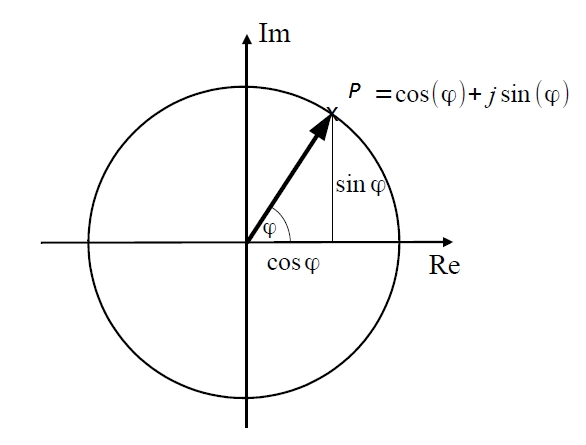
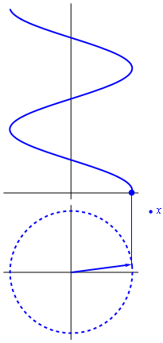
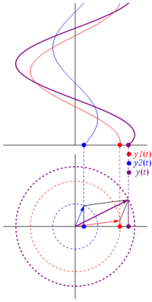

```{r setup, include=FALSE}
knitr::opts_chunk$set(echo = TRUE, fig.align='center', out.width = '60%')
library("shiny")
library("reshape2")
library("ggplot2")
library("gridExtra")
```

---------------------------------------

En este tema vamos a recordar algunos conceptos matemáticos muy utilizados en el procesamiento digital del sonido como son las funciones sinusoidales y las transformadas de Fourier.

-----------------------------------------

# Funciones sinusoidales

Una función sinusoidal puede ser descrita a partir de la función coseno donde $n$ es la variable independiente (el índice de tiempo), $A$ es la amplitud de la oscilación, $\omega$ es la velocidad angular (frecuencia) que es igual a $2 * \pi * f$ siendo $f$ la frecuencia en Hz de la oscilación y $\varphi$ la fase inicial (en radianes).

$$x[n] = A \cdot cos (\omega nT + \varphi) = A \cdot cos (2 \pi fnT + \varphi)$$
El periodo de muestreo (en segundos) viene dado por: 

$$T = 1/f_{s} \quad  siendo \quad t = nT = n/f_{s}$$

En la figura podemos observar una sinusoide con una amplitud de 0.8, una frecuencia fundamental de 1000Hz y una tasa de muestreo de 44100 muestras/s.

```{r, echo=FALSE}
A = 0.8
f = 1000
phi = pi/2
fs  = 44100
t = seq(from = -0.002, to = 0.002, by = 1.0/fs)

x = A * cos(2*pi*f*t+phi)

plot(t, x, xlab="Tiempo", ylab="Amplitud", type='l')
```

Más información: [**Sinusoides (libro web)**](https://ccrma.stanford.edu/~jos/mdft/Sinusoids.html)

-----------------------------------------

# Números complejos y las funciones sinusoidales

Las señales que varían periódicamente suelen describirse como una combinación de funciones seno y coseno, como ocurre en el análisis de Fourier, y estas son expresadas más convenientemente como la parte real de una función exponencial con exponente imaginario, utilizando la **fórmula de Euler**.

$$e^{j \varphi} = \cos \varphi + j \sin \varphi$$

Un punto $P = A \cos \varphi + j A \sin \varphi$ puede reescribirse como $P = A e^{j \varphi}$ donde $A$ es la amplitud y $\varphi$ es la fase.

```{r, echo=FALSE}

```

En las siguientes animaciones podemos ver a un fasor generador de la función sinusoidal. Un fasor (o vector de fase o vector de Fresnel) es un número complejo que se utiliza para representar una oscilación ya que contiene información de la magnitud y de la fase de la sinusoide.

En su representación geométrica, puede interpretarse como un “número complejo rotatorio”.

Como podemos ver en el vídeo de la izquierda, la proyección del fasor (con movimiento circular uniforme) sobre el eje describe un movimiento oscilatorio armónico.

{ width=28%} { width=30% }

En el vídeo de la derecha podemos ver la evolución de dos magnitudes sinusoidales de igual frecuencia y de la suma en forma temporal y fasorial.

---
# Nota: La fase es un parámetro, entre otros, que sirve para definir el retardo de unas frecuencias con respecto a otras.
# Para que exista la fase, tiene que haber un movimiento que varía cíclicamente y, además, se tiene que poder medir. Las ondas sonoras al ser repetitivas, pueden dividirse en intervalos regulares y, por lo tanto, medibles. Aunque la fase es una diferencia verdadera de tiempo, siempre se mide en términos de ángulo, grados o radianes. Cuando dos ondas iguales comienzan al mismo tiempo, se dice que están en fase. Y sus intervalos (ángulos, grados o radianes) coincidirán. Eso provoca que una señal se refuerce con la otra, aumentando la amplitud (A). Al contrario, las ondas que están fuera de fase (desfasadas) se debilitan y diminuye la amplitud (A). Si dos ondas están en fase (0 grados de diferencia) y tienen la misma frecuencia, la forma y amplitud se doblarán en volumen. Si dos ondas están en oposición de fase (180 grados de diferencia) y tienen la misma frecuencia, la forma y la amplitud se cancelarán entre sí. Pero es muy difícil que estos dos casos ocurran en la realidad, son casos ideales que sirven como ejemplos para entender qué ocurre cuando dos señales están fase o desfase.
---

Más información: [**Video youtube**](https://www.youtube.com/watch?v=Cw9eFeVY74I&feature=player_embedded)

# Funciones sinusoidales complejas

Recordemos que una función sinusoidal compleja produce una respuesta compleja y, por tanto, si queremos representar gráficamente la función visualizaremos tanto su parte real como su parte imaginaria.

$$x[n] = A e^{j ( \omega n T + \varphi )} = A e^{\varphi} e^{j ( \omega n T )}$$
$$x[n] = A \cos ( \omega n T + \varphi ) + jA \sin ( \omega n T + \varphi)$$

En este caso, podemos ver en la figura la representación fasor de una función sinusoidal: su parte real y su parte imaginaria.

```{r, echo=FALSE}
N = 500
k = 3
t = seq(-N/2, N/2, by=1)

### Funcion exponencial
tt = complex(imaginary = t)
s  = exp(2*pi*k/N*tt)

df <- melt(data.frame(x = t, real = Re(s), imaginary = Im(s)), id = "x")

ggplot(df, aes(x = x, y=value, color=variable)) +
	geom_line(size=1) +
	xlab("Tiempo") + 
	ylab("Amplitud") +
	theme(legend.title=element_blank())
```

Más información: [**Sinusoides complejas (libro web)**](https://ccrma.stanford.edu/~jos/mdft/Complex_Sinusoids.html)

-----------------------------------------

# Funciones pares e impares

Una señal sinusoidal se dice par o simétrica si es idéntica a su reflexión alrededor del origen. Decimos que una señal sinusoidal es impar si es la opuesta a su reflexión alrededor del origen.

---

|     $f[n]$ es una función par si $f[−n] = f[n]$ (simétrica)\
|     $f[n]$ es una función impar si $f[−n] = −f[n]$  (antisimétrica)\

---

Como podemos ver en la siguiente figura la función coseno es par y la función seno es impar.

```{r, echo=FALSE}
N = 500
k = 3
t = seq(-N/2, N/2, by=1)

### Funcion exponencial
tt = complex(imaginary = t)
s = exp(2*pi*k/N*tt)

df <- melt(data.frame(x = t, real = Re(s), imaginary = Im(s)), id = "x")

df2 <- df
levels(df2$variable)[levels(df2$variable)=="real"]      <- "coseno(even)"
levels(df2$variable)[levels(df2$variable)=="imaginary"] <- "seno(odd)"

ggplot(df2, aes(x = x, y=value)) +
	facet_wrap(~variable) + 
	geom_line(size=1) +
	xlab("Tiempo") + 
	ylab("Amplitud") +
	geom_vline(xintercept=0, colour="green", size=1.2)
```

-----------------------------------------

# Convolución

Cuando se suman o se restan dos sinusoides, el espectro de la onda resultante es igual a la suma o a la resta de los espectros de las dos sinusoides.

Sin embargo, cuando se multiplican las dos sinusoides, el espectro de la onda resultante no es la multiplicación de ambos espectros, sino la convolución de estos.

La propiedad de la convolución establece que la convolución en el dominio temporal corresponde a la multiplicación en el dominio de la frecuencia.

$$y[n] = (x_{1}[n] * x_{2}[n])_{n} = \sum_{m=0}^{N-1} x_{1}[m] x_{2}[n-m]$$

En este caso, hemos obtenido la convolución de una función triangular con una función rectangular como puede verse en la siguiente figura:

```{r, echo=FALSE}
dir.old <- getwd()
setwd("code")
source('triangle1.R')
source('rectangle1.R')
setwd(dir.old)
```

```{r, echo=FALSE}
t <- seq(0, 70, by=1)
x1 <- triangle1(t, 0, 30)
x2 <- rectangle1(t, 0, 30)

# Convolucion
c  <- convolve(x1, rev(x2), type="open")

df1 <- melt(data.frame(x = t, triangle = x1, rectangle = x2), id = "x")

p1 <- ggplot(df1, aes(x = x, y=value)) +
		facet_wrap(~variable, scales="free") + 
		geom_line(size=1) +
		xlab("") + 
		ylab("")

df2 <- data.frame(x=1:length(c), y=c)

p2 <- ggplot(df2, aes(x = x, y=y)) +
		geom_line(size=1) +
		xlab("") + 
		ylab("")

grid.arrange(p1, p2, ncol=1)
```

Más información: [**Convolución (libro web)**](https://ccrma.stanford.edu/~jos/mdft/Convolution.html)

# Referencias

Nos parece muy interesante el libro digital de uso libre no solamente para esta clase de repaso de conceptos matemáticos sino para todas las clases de este módulo de procesamiento del sonido digital.

* [**Spectral Audio Signal Processing**](https://www.dsprelated.com/freebooks/sasp/)
* [**Demos**](http://pages.jh.edu/~signals/)